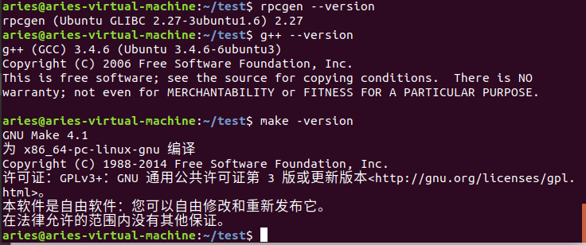
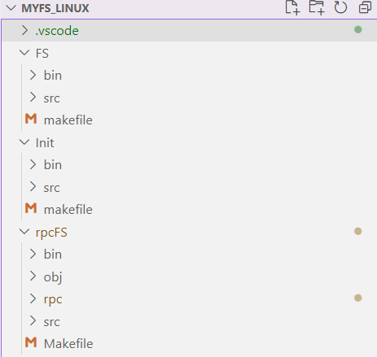
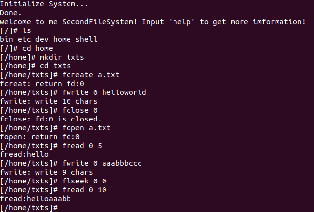
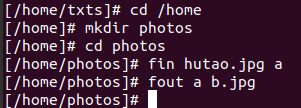
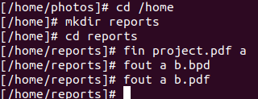
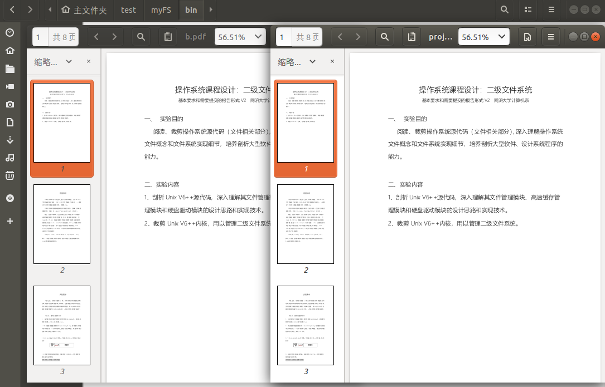
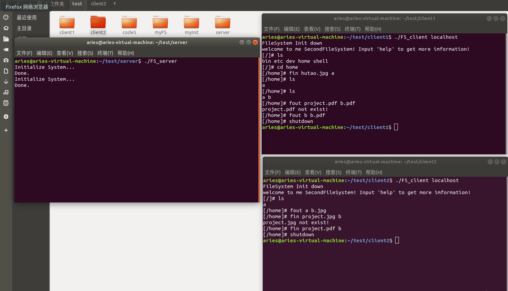
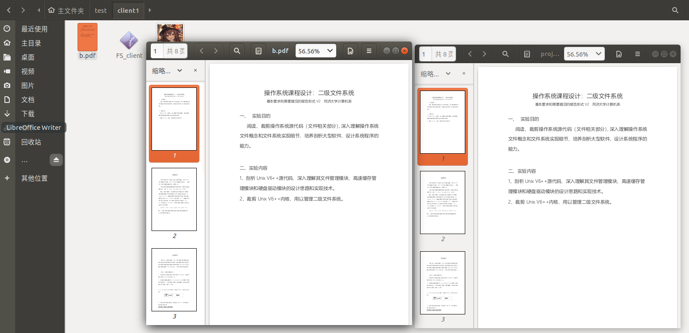

同济大学操作系统课程设计 

# 实验环境和使用说明

## 实验环境

Ubuntu 18.04 Linux虚拟机

## 编译环境

## 使用说明

Init FS rpcFS分别表示磁盘初始化程序、二级文件系统程序、文件服务器程序，在相应的文件夹下使用**make**命令即可在bin文件夹中得到可执行程序，其中二级文件系统和文件服务器都需要使用磁盘初始化程序生成初始的磁盘文件。

myFS.exe和FS_client启动后都会有提示信息。

# 二级文件系统测试

目录切换到home下，并创建txts子目录，在txts子目录下实现文件的随机读写：

将目录切换到home/photos中，实现图片的无损fin fout:

将目录切换到home/reports子目录中，实现pdf的无损fin fout:

# 文件服务器测试

初始时有3个文件夹：

client1（包含FS_client hutao.jpg）

client2（包含FS_clientproject.pdf）

server（包含FS_server Secondary.img）

我们进行如下操作：

将client1中hutao.jpg和client2的project.pdf都fin，在fout到另一个client中，文件是无损的，如下图：

